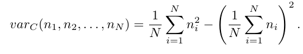

# Laboratorio 3: selezione, cicli e array

In questo laboratorio useremo selezioni (annidate/tronche), cicli pre- e post-condizionati. Useremo anche un nuovo strumeto: gli array.

## Ricordate
- compilare: __g++ `<nomefilesorgente> ` -o `<nomefileeseguibile> `__
- eseguire:` ./<nomefileeseguibile> `

Niente spazi tra . e / e tra / e monefile
- convenzionalmente il file sorgente si indica con estensione .C oppure .cpp oppure .cxx. Questo consente, tra l'altro, anche a gedit di inferire la tipologia di contenuto del file e evidenziare la sintassi.

## Esercizio 1
Scrivete un programma che, letti in ingresso due numeri razionali __float__ stampi a video i due numeri in ordine non decrescente. Il programma dovrà anche rilevare l'inserimento di numeri uguali e stampare, in tal caso, a video anche il messaggio "Numeri uguali".

## Esercizio 2
Scrivere un programma che chieda all'utente di inserire un numero intero positivo fino a che l'utente non inserisce effettivamente un numero positivo. Obbligatorio l'uso di un ciclo post-condizionale.

## Esercizio 3
Scrivere un programma che legga in ingresso una sequenza di numeri positivi terminata dall'inserimento, da parte dell'utente, dello zero. Il programma, oltre a calcolare la somma e la media aritmetica dei valori inseriti (vedi esercizio 4 settimana 2), dovrà anche calcolare la _varianza del campione_ definita come:
 

## Esercizio 4
Estendere le funzionalità del programma scritto per l'esercizio 3 alla determinazione dei valori validi (>0) massimo e minimo (da stampare a video insieme alle altre grandezze).

## Esercizio 5
Dichiarato un vettore di 10 interi, modificare l'esercizio 4 in modo tale che:

1. I dati validi vengano ciascuno memorizzato in una componente del vettore: il primo dato nella prima componente del vettore, il secondo nella seconda, e così via....
1.  Se l'utente inserisce il valore 0 o  il vettore è pieno (10 interi validi inseriti) blocchi l'inserimento e stampi totale, media, varianza del campione, massimo e minimo riferiti ai dati memorizzati nell'array.

__NOTA__: il ciclo di caricamento dovrà  sempre fare un controllo sul numero di dati già  registrati nell'array.
